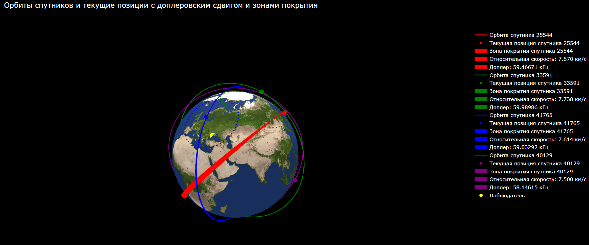

# Проект «Земля – космический аппарат»

Проект является набором инструментов для мониторинга и анализа спутников, основанных на данных TLE (Two-Line Element Set). Этот репозиторий содержит код для загрузки данных TLE, расчета орбит и прохождений спутников, а также визуализации результатов с помощью Plotly.

## Памятка

### Установка

#### 1. Клонируйте репозиторий:

```
git clone https://github.com/ChaVi6/spacecraft.git
```

#### 2. Установите необходимые пакеты:

```
pip install numpy sgp4 plotly pillow
```

### Использование

1. Загрузите данные TLE в файл tle_data.txt. Каждый спутник должен быть представлен двумя строками. В файле уже находится пример данных по умолчанию.

2. Введите вручную в терминале широту и долготу наблюдателя, а также номинальную частоту, мощность передатчика и коэффициенты усиления передатчика и приемника.

3. Запустите скрипт main.py. Скрипт рассчитает и выведет прохождения спутников, доплеровский сдвиг и принимаемую мощность для каждого спутника.

4. Скрипт также создаст 3D-визуализацию орбит спутников и текущих позиций, а также зон покрытия спутников.

### Функционал

- `load_tle_from_file`: загружает данные TLE из файла.
- `load_satellite_from_tle`: преобразует данные TLE в объект спутника.
- `satellite_position`: рассчитывает позицию спутника в заданное время.
- `is_satellite_visible`: проверяет, виден ли спутник для наблюдателя.
- `calculate_passes`: рассчитывает прохождения спутников для заданного периода времени.
- `observer_velocity`: рассчитывает скорость наблюдателя.
- `relative_speed`: рассчитывает относительную скорость между спутником и наблюдателем.
- `doppler_shift`: рассчитывает доплеровский сдвиг.
- `received_power`: рассчитывает принимаемую мощность.
- `calculate_coverage_area`: рассчитывает площадь покрытия спутника.
- `lat_lon_to_xyz`: преобразует широту и долготу в 3D-координаты.

### Пример

Пример полученной визуализации:



## Авторы

- Чаплин Виталий
- Сергиенко Кирилл
- Лучер Дмитрий
- Соболев Павел
